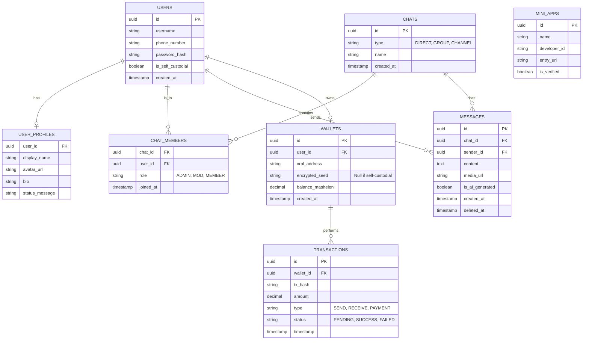

# Database Schema: MXit 2.0

### Notes
- **Database Choice**: PostgreSQL for relational data (Users, Wallets, Transactions, Mini-Apps).
- **High-Volume Data**: Messages may be archived into a NoSQL store (e.g., Cassandra/ScyllaDB) for scalability.
- **Caching**: Redis used for active presence, typing indicators, and session states.
