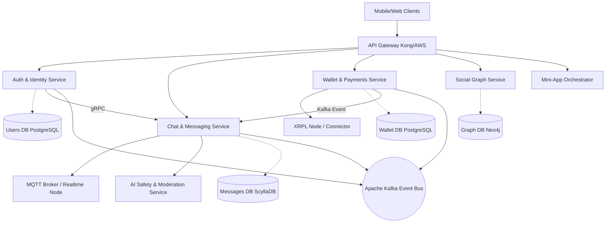

# Microservices Architecture: MXit 2.0

## Key Services
1. **Auth & Identity Service**: Handles registration, JWT issuance, and KYC for the wallet.
2. **Chat & Messaging Service**: Manages routing of messages, storing histories, and interfacing with the MQTT broker for real-time delivery.
3. **Wallet & Payments Service (Masheleni)**: Interfaces with the XRPL. Manages platform-custodial wallets and verifies self-custodial transactions.
4. **Social Graph Service**: Manages friends, followers, blocked users, and feed generation.
5. **Mini-App Orchestrator**: Manages the lifecycle, auth tokens, and billing events for 3rd-party mini-apps.
6. **AI Safety & Moderation Service**: Asynchronously consumes message events from Kafka to detect toxicity and flag content.
