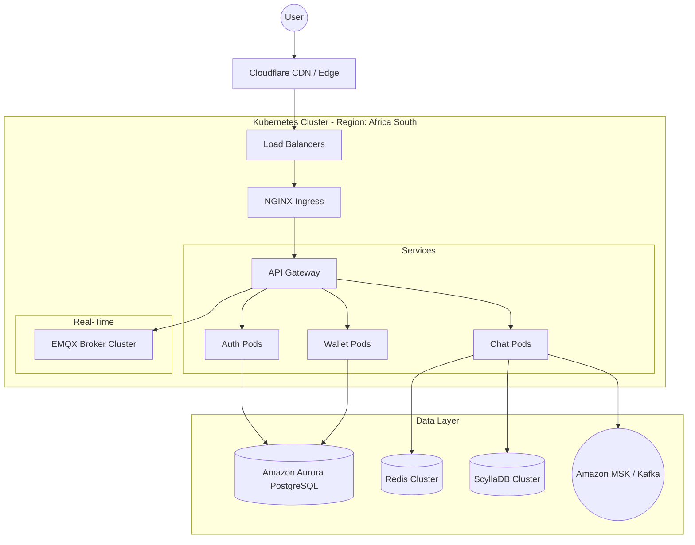

# Deployment Architecture: MXit 2.0

## 1. Cloud Provider
- **AWS (af-south-1)**: Deployed primarily in Cape Town to ensure ultra-low latency across Southern Africa, with secondary regions in eu-west-1 or me-south-1 for redundancy.

## 2. Orchestration
- **Kubernetes (EKS)**: All microservices are containerized and orchestrated via EKS. Horizontal Pod Autoscaling (HPA) is configured to handle traffic spikes during peak evening chat hours.

## 3. Data Tier
- **Relational Data**: Amazon Aurora PostgreSQL (Multi-AZ) for strict ACID compliance on user and financial records.
- **NoSQL Data**: ScyllaDB for massive write-heavy message loads.
- **Caching & Pub/Sub**: Redis Cluster for presence. Kafka for event streaming.

## 4. CI/CD Pipeline
- **GitHub Actions**: Runs unit/integration tests and linters.
- **ArgoCD**: Follows GitOps principles. Automatically deploys new container images pushed to ECR into the Kubernetes cluster.
